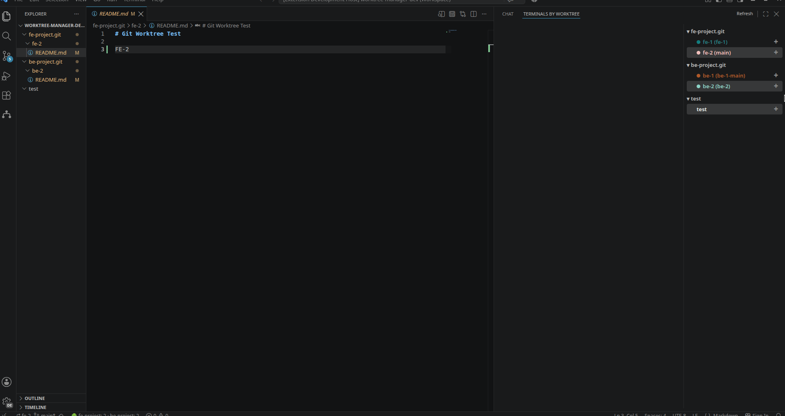

<div align="center">

# 🌳 Worktree Workspace Manager

**One home for every git worktree, every bare repo, and every terminal — right inside VS Code.**

Stop juggling windows. Stop guessing which terminal belongs to which branch. Stop hunting for the right worktree folder. Worktree Workspace Manager turns the chaos of the AI-era, many-branches-at-once workflow into one clean, colored, clickable tree.



</div>

---

## 🤔 Why?

Working with **git worktrees + bare repos** is the most powerful way to run multiple branches in parallel — but in practice it's a mess:

- 🪟 You end up with **10 VS Code windows**, one per worktree.
- 🖥️ You have **10 terminal tabs** and no idea which one is `feat-login` and which is `fix/styles`.
- 🔁 Every time you switch context, you manually **kill the old dev server**, **start a new one**, **close the stale editor tabs**, and lose your train of thought.

This is exactly the pain that built up over the last year of intense AI-assisted, multi-branch development. **Worktree Workspace Manager exists to make it better.**(I hope so)

It derives everything from **git itself** — no databases, no sidecar files, no sync issues. Your worktrees are the source of truth; the extension just makes them _visible, grouped, and actionable._

---

## ✨ Features

### 1. 🗂️ A tree that mirrors your repos and worktrees

A dedicated **Worktree** explorer shows every bare repo as a folder, and every worktree underneath as `name (branch)`. Each worktree gets a **stable color dot** (24-hue palette, hashed from its name), so the same branch always looks the same — across refreshes, across restarts, across both views.

```
fe-project.git
  ● feat-login (feat/login)
  ● fix-styles (fix/styles)
be-project.git
  ● api-auth (feat/auth)
```

### 2. 🖥️ Terminals grouped by worktree & repo

The **"Terminals by Worktree"** panel nests your terminals under their owning worktree and bare repo — so you instantly see _what's running where_. Click a terminal to focus it, or open one in any worktree with **Open Terminal Here**. No more guessing which anonymous tab is which.

### 3. ⚡ One-click task switching (kill the old, start the new)

Selecting or **✓ checking** a worktree triggers a smooth, configured transition _per repo_:

1. **Cleanup** commands run against the **previously selected** worktree (e.g. `kill $PID`, stop the old dev server).
2. Only if cleanup succeeds, the new worktree's **cmd** launches in a fresh embedded terminal.

So flipping from `feat-login` to `fix/styles` automatically tears down one branch's process and spins up the other's — without you touching a thing.

### 4. 🧹 Auto-close editors from non-selected worktrees

When you focus a worktree, the extension **hides every other worktree's files** (via `files.exclude` / `search.exclude`) and **closes editor tabs that don't belong to the one you just selected**. Your workspace stays focused on a single context at a time.

> 📝 To make a single worktree visible, the extension rewrites the `files.exclude` / `search.exclude` keys **in your `.code-workspace` file** — that on-disk change is normal and flips back when you switch worktrees.

### 5. 📊 Live status bar + Quick Pick menu

A status-bar item always shows a live summary (`🌳 fe-project: 3 · be-project: 4`). Click it for a context-aware Quick Pick of every action — add, remove, fetch, prune, configure, and more.

---

## 🚀 Quick start

> **Requirements:** VS Code 1.90+ and **git** on your `PATH`. Install from the Marketplace, then configure as below.

The extension is built around two simple principles:

1. ✅ **Open a VS Code workspace** (a `.code-workspace` file, _not_ a plain folder). The "focus one worktree" feature rewrites `files.exclude` / `search.exclude` in that workspace file.
2. ✅ **List your bare repos** in `worktreeManager.repositories`.

> ⚠️ **Your `.code-workspace` file will be modified — this is expected.**
> Showing **only one worktree at a time** means focusing a worktree writes `files.exclude` and `search.exclude` entries into your `.code-workspace` that hide every _other_ worktree's files (and clears them again when you switch). The extension owns those exclude keys for you; treat the rest of the workspace file as your own.

### Step 1 — Put your bare repos in a workspace file

```jsonc
// my-project.code-workspace
{
  "folders": [],
  "settings": {
    "worktreeManager.repositories": [
      "~/code/repos/fe-project.git",
      "~/code/repos/be-project.git",
    ],
  },
}
```

### Step 2 — (Optional) define per-repo tasks

Tasks are keyed by the **bare repo's basename including `.git`**. `cmd` runs when a worktree is selected; `cleanup` runs on the _previous_ worktree before the switch.

```jsonc
"worktreeManager.tasks": {
  "fe-project.git": {
    "env":     { "PORT": "4000" },
    "cleanup": ["echo cleaning up fe-project.git"],
    "cmd":     ["npm run dev"]
  },
  "be-project.git": {
    "env":     { "PORT": "5000" },
    "cleanup": ["echo cleaning up be-project.git"],
    "cmd":     ["uvicorn main:app --port $PORT"]
  }
}
```

### Step 3 — Use it 🎉

- Open the **🌳 Worktree Workspace** activity bar.
- Expand a repo, **click a worktree** (or hit its ✓ checkbox) to focus it — editors tidy up, the old task cleans up, the new one starts.
- Use the **status bar** menu for repo-level actions (add, fetch, prune, configure).

---

## 🎛️ Commands & actions

| Action                      | What it does                                                            |
| --------------------------- | ----------------------------------------------------------------------- |
| **Add Worktree…**           | Pick a repo → name a branch → `git worktree add`.                       |
| **Check Worktree**          | Focus a worktree: hide the others, close foreign editors, run its task. |
| **Open Terminal Here**      | Launch an embedded terminal scoped to a worktree.                       |
| **Run Worktree Task**       | Manually re-run a worktree's task (kills & restarts).                   |
| **Remove Worktree**         | `git worktree remove` (with confirmation).                              |
| **Kill Related Terminals**  | Close embedded terminals for a worktree.                                |
| **Close All Terminals**     | Close every terminal for a repo.                                        |
| **Fetch**                   | `git fetch` on the repo.                                                |
| **Prune Stale**             | `git worktree prune`.                                                   |
| **Refresh**                 | Reload the tree.                                                        |
| **Configure Repositories…** | Jump straight to `settings.json`.                                       |

---

## 🧠 How it works (the short version)

- **Git is the single source of truth.** State comes from `git --git-dir=<bare.git> worktree list --porcelain` on every refresh. Nothing is stored, so a renamed or moved worktree is reflected automatically.
- **No sidecar files.** Labels, groupings, colors, and statuses are _derived_ each time.
- **Colors are stable.** Each worktree's hue = `palette[hash(name) % 24]` over a curated 24-color palette — identical across refreshes and restarts, with zero persistence.

---

## ⚙️ Configuration reference

| Setting                        | Type       | Description                                                                                                                           |
| ------------------------------ | ---------- | ------------------------------------------------------------------------------------------------------------------------------------- |
| `worktreeManager.repositories` | `string[]` | Bare git repos to manage. `~` is expanded; env vars are not.                                                                          |
| `worktreeManager.tasks`        | `object`   | Per-repo task definitions, keyed by bare repo basename (incl. `.git`). Each has `cmd` (required), optional `cleanup`, optional `env`. |

---

## ❓ Requirements & FAQ

**Does it need a `.code-workspace` file?**
Yes. To show just one worktree at a time, the extension writes `files.exclude` and `search.exclude` entries into your `.code-workspace` that hide the other worktrees' files — and these only persist at workspace scope (a plain folder has nowhere to store them). So **expect your `.code-workspace` file to change** whenever you focus a worktree; that's the extension doing its job, not a stray edit.

**Can I manage non-bare repos?**
No — the design is built around **bare repos** (`project.git`), since a bare repo can't be opened as a folder and instead exposes its worktrees. Add your bare repos to `worktreeManager.repositories` and you're set.

**Where are my colors / labels stored?**
Nowhere. They're derived from the worktree name on every refresh — git is the only source of truth.

**Why did my embedded terminal disappear after a task switch?**
That's the task transition doing its job: it ran `cleanup` on the previous worktree, disposed its terminal, then launched the new one. Re-select a worktree to bring its task back.

---

## 📜 License

MIT — built to scratch a very real itch. Contributions welcome!
